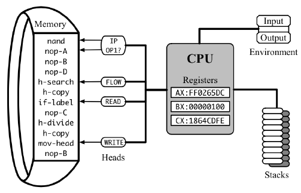

컴퓨터공학 전공서를 본 적이 있다면, 아마 초반에 계산 복잡도 라는 개념이 등장했을 것입니다. 간단히 말하자면, 이는 계산 중 수행되는 원자적 연산(덧셈, 곱셈, 읽기, 쓰기 등)의 총 횟수를 의미하며, 필요에 따라 각 연산에 가중치를 부여할 수도 있습니다.

복잡도는 오래된 개념이며, 1960년대 초에 [체계적으로 정립](http://www.cs.albany.edu/~res/comp_complexity_ams_1965.pdf)되었습니다. 그 이후로 알고리즘 설계에서 비용 함수로 보편적으로 사용되어왔습니다. 이 모델이 빠르게 받아들여진 이유는, 당시 컴퓨터의 작동 방식과 잘 부합하는 근사 모델이었기 때문입니다.

### 고전적 복잡도 이론

CPU의 원자적 연산은 **명령어**라고 하며, 이때의 비용은 **지연**이라 부릅니다. 명령어는 **메모리**에 저장되어 프로세서에 의해 하나씩 실행됩니다. 프로세서는 여러 개의 **레지스터**에 내부 **상태**를 저장합니다. 이 레지스터 중 하나인 명령어 포인터(Instruction Pointer)는 다음에 읽고 실행할 명령어의 메모리 주소를 가리킵니다. 각 명령어는 특정 방식으로 프로세서의 상태를 변경하며(명령어 포인터 이동 포함), 메인 메모리를 수정할 수 있고, 다음 명령어가 시작되기 전까지 완료되기 위해 서로 다른 수의 **CPU 사이클**이 필요합니다.

프로그램의 실제 실행 시간을 추정하려면, 실행된 명령어들의 모든 지연 시간을 합산한 뒤, 특정 CPU가 1초에 수행하는 사이클 수인 **클럭 주파수(Clock Frequency)**로 나누어야 합니다.

클럭 주파수는 CPU 모델, 운영체제 설정, 마이크로칩의 현재 온도, 다른 구성 요소들의 전력 사용량 등 여러 요인에 따라 자주 변동됩니다. 반면, 명령어 지연 시간은 정적이며, 클럭 사이클 기준으로 보면 서로 다른 CPU 간에도 어느 정도 일관성을 보이기 때문에, 이를 계산하는 것이 분석 목적에는 더욱 유용합니다.

예를 들어, 정의에 따른 행렬 곱셈 알고리즘은 총 $n^2 \cdot (n + n - 1)$회의 산술 연산을 필요로 합니다. 구체적으로는 $n^3$번의 곱셈과 $n^2 \cdot (n - 1)$번의 덧셈이 수행됩니다. 이러한 명령어들의 지연 시간을 [명령어 테이블](https://www.agner.org/optimize/instruction_tables.pdf)과 같은 문서를 통해 조사해보면, 예를 들어 곱셈은 3사이클, 덧셈은 1사이클이 소요된다는 것을 알 수 있습니다. 따라서 전체 계산에 필요한 클럭 사이클 수는 $3 \cdot n^3 + n^2 \cdot (n - 1) = 4 \cdot n^3 - n^2$이 됩니다.(물론, 이러한 계산은 데이터 제공 등 다른 작업들을 무시한 단순한 추정입니다.)

이처럼 명령어 지연 시간의 합이 실행 시간의 대략적인 척도로 사용될 수 있는 것처럼, 계산 복잡도는 특정한 컴퓨터를 전제로 하지 않고 추상적인 알고리즘의 고유한 시간적 요구사항을 정량화하는 데 사용할 수 있습니다.

### 점근적 복잡도

입력 크기에 따른 실행 시간을 함수로 표현하는 발상은 지금은 당연하게 느껴지지만, 1960년대에는 그러하지 않았습니다. 당시의 [전형적인 컴퓨터](https://en.wikipedia.org/wiki/CDC_1604)는 수백만 달러의 비용이 들었으며, 별도의 공간을 필요로 할 정도로 거대했고, 클럭 주파수는 kHz 단위로 측정되었습니다. 그러한 컴퓨터들은 날씨 예측, 우주로 로켓 발사, 또는 소련의 핵 미사일이 쿠바 해안에서 얼마나 멀리 날아갈 수 있는지를 계산하는 등 실질적인 문제해결에 주로 사용되었습니다. 이러한 문제들은 모두 유한한 크기의 문제였습니다. 당시 엔지니어들은 $n \times n$행렬보다는 $3 \times 3$을 곱하는 방법에 더 관심이 많았습니다.

이러한 사고의 전환은 컴퓨터 과학자들 사이에서 "컴퓨터는 앞으로 계속 빨라질 것"이라는 확신이 생기면서 나타났고, 실제로도 그렇게 되었습니다. 시간이 지나면서 사람들은 더 이상 실행 시간을 세지 않게 되었고, 이후에는 사이클 수, 그리고 정확한 연산 수조차 세지 않게 되었습니다. 대신 충분히 큰 입력에 대해서는 오차가 일정한 상수 배 이내로 제한되는 추정치를 사용하기 시작했습니다. 이렇게 해서 $4 \cdot n^3 - n^2$ 같은 장황한 표현은 $\Theta(n^3)$이라는 간단한 점근 표기법으로 대체되었습니다. 이 표기법은 각 명령어의 초기 비용은 물론이고 하드웨어의 복잡성까지도 "Big O" 기호 안에 숨깁니다.

점근 복잡도를 사용하는 이유는, 이 표기법이 대규모 데이터셋에 대해 상대적인 알고리즘 성능을 비교할 수 있을 만큼 충분히 정확하면서도 매우 단순하기 때문입니다. 결국 컴퓨터가 충분히 커진 입력에 대해서도 합리적인 시간 내에 처리할 수 있을 것이라는 믿음 하에, 점근적으로 더 빠른 알고리즘은 숨겨진 상수와 관계 없이 실질적으로도 항상 더 빠를 것이라고 여겨졌습니다.

하지만 이 믿음은 완전히 맞는 것은 아니었습니다. 적어도 클럭 속도와 명령어 지연 시간이라는 관점에서는 그렇지 않았습니다. 이 장에서는 그 이유와, 이를 어떻게 다루어야 하는지 설명하겠습니다.
